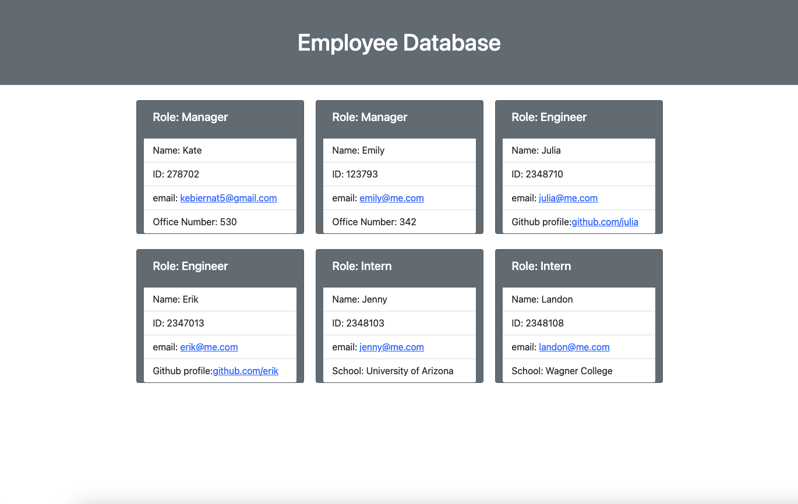

# Making-a-Profile-Generator

## Links

* The link to see the functionality demonstration of this repository can be found at https://youtu.be/1d83txMVZYg.
* The link to this repository can be found at https://github.com/kebiernat5/Making-a-Profile-Generator

## Process
The task at hand was to create classes to compose a dynamic directory of managers, staff, and interns. 

I first installed the npm json files and node modules to run jest. Then I created the classes of types of employees and subsequently ran the tests to be sure the classes were functional.

After that, I set about installing the appropriate inquirer function to make the index.js file function. I wrote functions to invoke inquire and then I created a function at the end with template literals to write an html file which I styled using bootstrap. 

Then the console logs the following information:

Immediately following inputting data. an index.html file is created to reflect the information added with inquirer. The html file in the browser looks like this:

